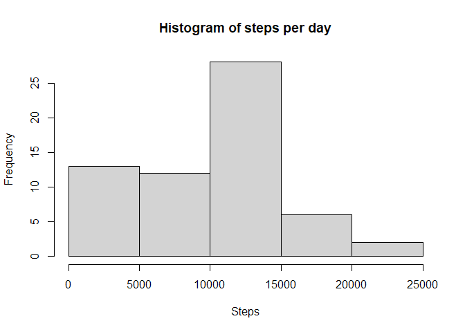
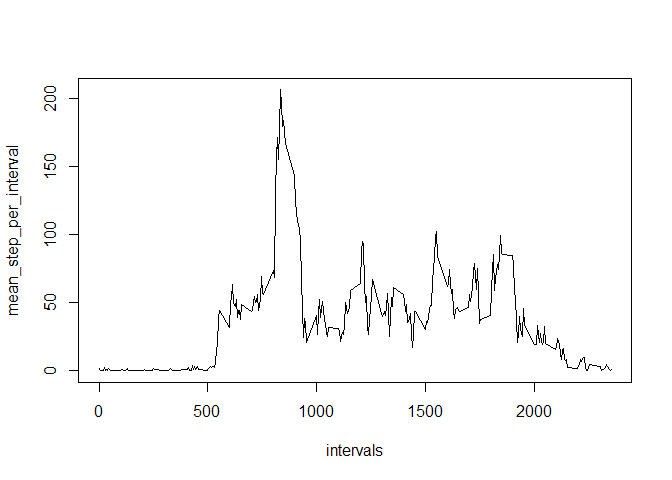
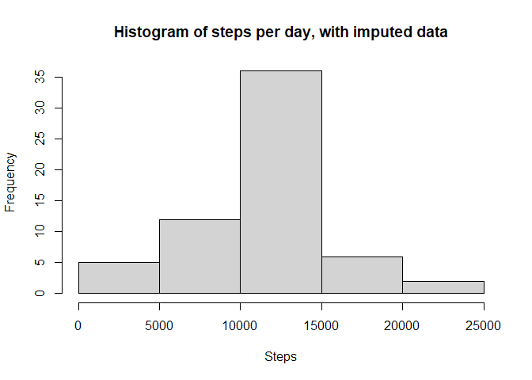
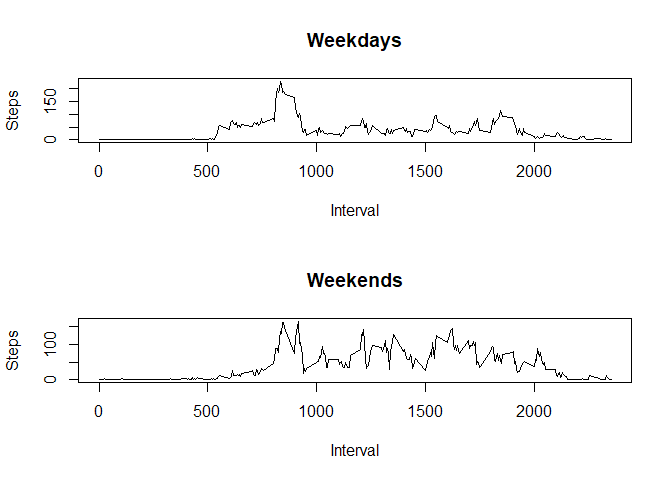

## Loading and preprocessing the data
First we install and load packages:


```r
#Install code is commented out since it's only needed once
#install.packages('reshape2')
#install.packages('ggplot2')
#install.packages('tidyverse')
library(reshape2)
library(tidyverse)
```

```
## ── Attaching core tidyverse packages ──────────────────────── tidyverse 2.0.0 ──
## ✔ dplyr     1.1.1     ✔ readr     2.1.4
## ✔ forcats   1.0.0     ✔ stringr   1.5.0
## ✔ ggplot2   3.4.2     ✔ tibble    3.2.1
## ✔ lubridate 1.9.2     ✔ tidyr     1.3.0
## ✔ purrr     1.0.1     
## ── Conflicts ────────────────────────────────────────── tidyverse_conflicts() ──
## ✖ dplyr::filter() masks stats::filter()
## ✖ dplyr::lag()    masks stats::lag()
## ℹ Use the conflicted package (<http://conflicted.r-lib.org/>) to force all conflicts to become errors
```

```r
library(ggplot2)
library(data.table)
```

```
## 
## Attaching package: 'data.table'
## 
## The following objects are masked from 'package:lubridate':
## 
##     hour, isoweek, mday, minute, month, quarter, second, wday, week,
##     yday, year
## 
## The following objects are masked from 'package:dplyr':
## 
##     between, first, last
## 
## The following object is masked from 'package:purrr':
## 
##     transpose
## 
## The following objects are masked from 'package:reshape2':
## 
##     dcast, melt
```

Then read and process the data:


```r
data        <- read.csv('activity.csv')
wide_data   <- dcast(data, interval ~ date, value.var="steps") # this produces a warning, but still works
```

```
## Warning in dcast(data, interval ~ date, value.var = "steps"): The dcast generic
## in data.table has been passed a data.frame and will attempt to redirect to the
## reshape2::dcast; please note that reshape2 is deprecated, and this redirection
## is now deprecated as well. Please do this redirection yourself like
## reshape2::dcast(data). In the next version, this warning will become an error.
```

```r
intervals   <- wide_data[,1]
steps       <- wide_data[,2:dim(wide_data)[2]]
```

## What is mean total number of steps taken per day?


```r
days = dim(wide_data)[2]-1
steps_per_day <- t(colSums(steps, na.rm = TRUE))
hist(steps_per_day, main = paste("Histogram of steps per day"),
     xlab = 'Steps', ylab = 'Frequency')
```

<!-- -->

```r
mean_steps = mean(steps_per_day)
sprintf('Mean steps per day is %.2f',mean_steps)
```

```
## [1] "Mean steps per day is 9354.23"
```

```r
median_steps = median(steps_per_day)
sprintf('Median steps per day is %.2f',median_steps)
```

```
## [1] "Median steps per day is 10395.00"
```

## What is the average daily activity pattern?


```r
mean_step_per_interval <- rowMeans(steps, na.rm = TRUE) #still have NAs, so have to ignore them
plot(intervals,mean_step_per_interval, type = "l")
```

<!-- -->

```r
max_steps_index <- which.max(mean_step_per_interval) #finding position of max value
sprintf('The most active interval is %d, where %.2f steps are taken, on average', intervals[max_steps_index], mean_step_per_interval[max_steps_index])
```

```
## [1] "The most active interval is 835, where 206.17 steps are taken, on average"
```


## Imputing missing values


```r
num_of_nas <- sum(is.na(steps))
sprintf('There are %.0f missing values',num_of_nas)
```

```
## [1] "There are 2304 missing values"
```

```r
imp_steps <- steps
for (i in 1:length(intervals)) {
  imp_steps[i,is.na(steps[i,])] <- mean_step_per_interval[i] #replacing NAs with mean for that interval
}

imp_steps_per_day <- t(colSums(imp_steps, na.rm = TRUE)) #transposing the sum for plotting
hist(imp_steps_per_day, main = paste("Histogram of steps per day, with imputed data"),
     xlab = 'Steps', ylab = 'Frequency')
```

<!-- -->

```r
imp_mean_steps = mean(imp_steps_per_day)
sprintf('Mean steps per day is %.2f',imp_mean_steps)
```

```
## [1] "Mean steps per day is 10766.19"
```

```r
imp_median_steps = median(imp_steps_per_day)
sprintf('Median steps per day is %.2f',imp_median_steps)
```

```
## [1] "Median steps per day is 10766.19"
```
We see that the mean and median were altered by the inclusion of our imputed step values.

## Are there differences in activity patterns between weekdays and weekends?


```r
day_of_week <- weekdays(as.Date(names(imp_steps))) #converting dates to weekday names

weekday_or_end <- day_of_week # creating weekday/end array
for (i in 1:days) {
  if ((day_of_week[i]=="Sunday") | (day_of_week[i]=="Saturday")) {
    weekday_or_end[i] <- 'weekend'
  }
  else {
    weekday_or_end[i] <- 'weekday'
  }
}

my_fac            <- factor(weekday_or_end) #creating factor
#selecting columns based on where the factor is weekend or day
mean_weekday <- rowMeans(imp_steps[,which(my_fac == 'weekday')]) 
mean_weekend <- rowMeans(imp_steps[,which(my_fac == 'weekend')])

par(mfrow = c(2,1))
plot(intervals,mean_weekday,ylab='Steps',xlab='Interval',type='l',col='black', main='Weekdays')
plot(intervals,mean_weekend,ylab='Steps',xlab='Interval',type='l',col='black', main='Weekends')
```

<!-- -->

